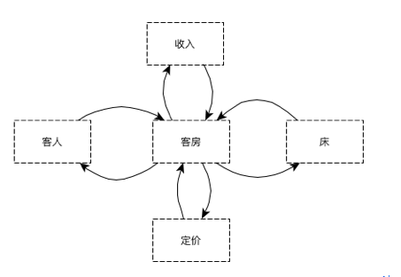
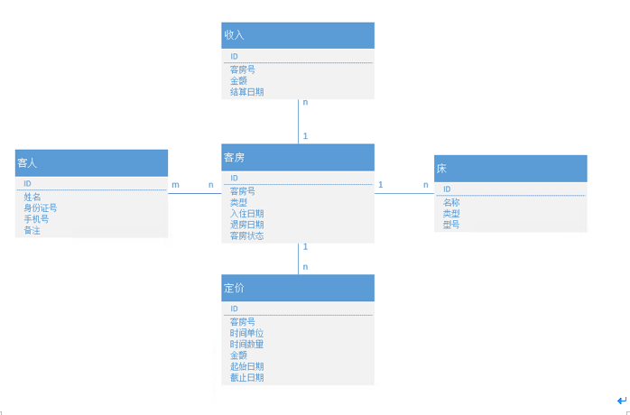
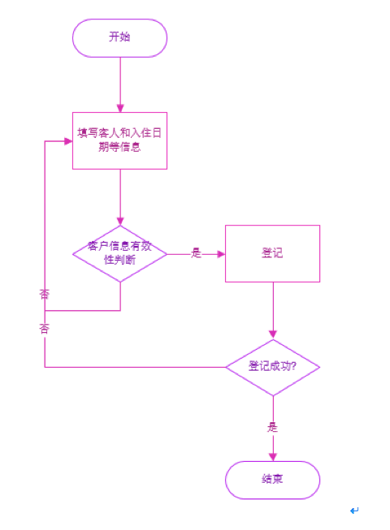
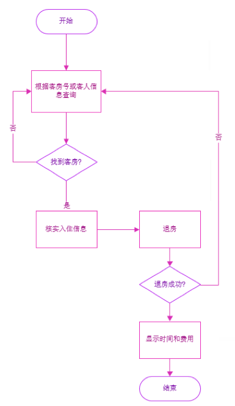
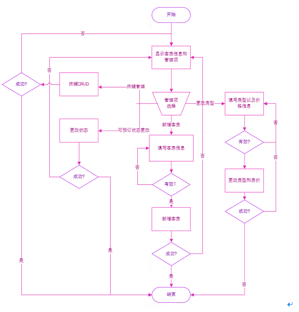
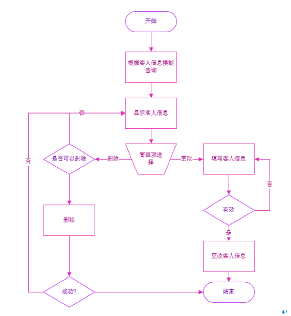

### 酒店管理系统

## 模型设计

酒店管理系统，主要涉及到登记入住，退房以及客房和客人信息管理；经过分析抽像出涉及到的实体以及各实体之间的关系：  

可以看出整个业务以客房为中心，入住，退房，定价，收费都是以客房为基本单位，所以需要以客房为中心来设计各实体之间的关系。

我们来看一下，各实体中的字段以及各实体之间的关系图:  

    

## 业务流程

### 登记入住   

     

### 退房   

   

### 管理   

#### 客房信息管理    

   

#### 客人信息管理   

   

### 退房   

\使用背景\     

退房是客人登记入住后，到时间后退房使用；   

\主要逻辑\

退房功能首先是用户通过条件查询到需要退的客房，确认信息无误后，点击退房按钮，后端会根据入住，退房时间以及当前房价进行计算，如果退房成功，则返回用户退房结果，包括客人入住的时间以及房费。

### 管理

#### 客房管理

\使用背景\     

客房管理是当新增客房，修改房型，管理床铺等时使用；不能删除客户，因为客户会参与到一系列的业务中，不允许删除，允许置为不可预订状态；   

\主要逻辑\   

首先会分页列出所有客房信息，包括客房当前状态，房型，房价，床铺数，客人数以及总收入，并可进行相应排序与筛选。     

客房当前有客时，不可以修改房型与可预订状态。   

用户点击新增客房按钮时，会弹出对话框，填写客房号以及房型，确认房存，当然前端会要求房号和房型必填，后端也会进行相应判断，而且还会判断客房号是否已存在，如果不存在，则添加客房默认状态，并新增，新增成功后，前端会将后端返回的新客房信息放入列表中。    

用户点击更改房型时，弹出对话框，用户选择房型(小时房、天房、月房),会带出这几个房型当前最新价格以及有效期(没有，则截止日期默认为9999-12-31 23:59:59)，当用户选择小时房时，有效期精确到分钟，其它房型到天，用户可以更改当前房价，有效期间也可以不更改，确定保存，浏览器等待服务器返回正确或错误的消息，然后进行相应提示，如果成功，则更改前端客房信息为最新信息。     

用户点击床铺管理时，弹出对话框，用户可以进行新增，修改，删除床铺，如果没有保存，则不会影响前端客房信息，确定时会等待后端处理返回，并给出相应消息提示，成功则个性前端客房信息，失败则不修改；     

用户点击可预订与不可预订状态开关时，会请求服务器，此时前端会等待，当服务器返回成功时，才修改前端客房当前状态，失败则给出消息，不做任何修改；   

#### 客人管理   

\使用背景\       

客人管理是当需要修改或清理客人信息时使用；不能用于新增客人，因为新增客人通过登记入口添加。    

\主要逻辑\    

用户首先根据客人信息模糊查询客人信息，然后进行更改或删除，当客人当前正入住时，则不允许删除(前后端都校验),修改包括修改客人姓名，身份证号，手机号，身份证号和手机号要符合相应的校验规则(前后端都校验),而且在保存时，后端还会判断身份证号不能与现在其它客人身份证号相同，确定无误后进行更新；在请求服务器时，浏览器会等待直到服务器返回结果；    

## 接口设计    

### 接口概览   

restful接口类共有两个，一个是客房接口，一个是客人接口     

其中客人接口查询，更新，删除，没有单独的增加接口，因为新增客人信息是通过客房的登记接口实现；    

客房的接口包括查询，新增，更改，其中查询有模糊查询和根据客房ID查询，而更新实质上有三个接口，一个是普通的更新接口，客房数据结构中有值的字段更新，null的字段则不更新；其它两个更新一个是登记，一个退房，这两个是特殊的更新，因逻辑与普通更新逻辑相差太大，所以单独拿出来；   

### 返回类型      

返回类型统一为：ResponseEntity<ResultDto>  

ResultDto 包括返回成功失败标识，消息码，消息，数据；ResponseEntity是Spring自带的类，使用它可以灵活自定义返回的HttpCode；这样当返回错误消息时，可以设置HttpCode为400或500等，而不是200，使语义一致。     

特殊情况：前端需要直接使用返回的结果情况下(比如自动补全搜索框，由前端请求服务端，直接得到结果，不需要封装)，不能使用这样的返回类型；   

前端通过service向服务器发起请求，统一处理服务器返回结果以及http错误消息，不用再到component中处理；    

### 异常处理   

前后端异常都是统一处理；前端是在service中处理，后端在统一的异常处理类中处理；异常处理类可以处理异常，还可以统一处理校验异常，包括controller方法参数的直接校验以及dto中的校验异常，不用在controller每个方法体中判断； 

## 3-19周，周二晚上的7-9点

## 9周的周二晚上答辩